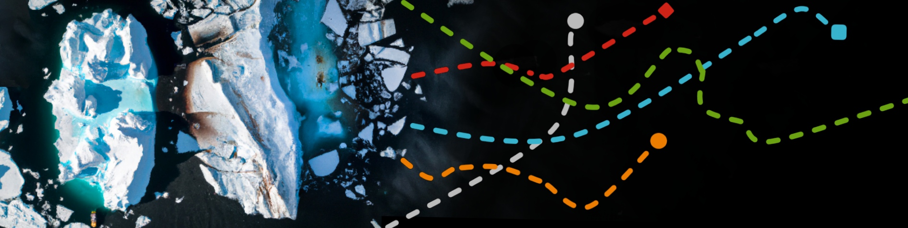
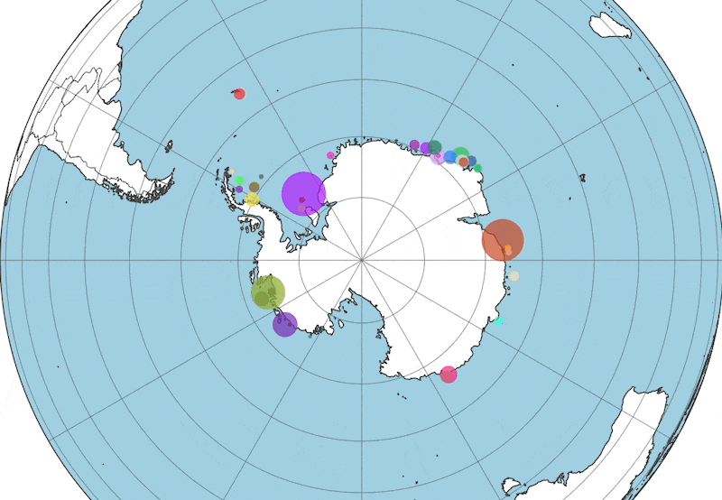

# Iceberg-Locations-Data

  

Weekly iceberg locations (2014-today) in a single file hosted on AWS S3.

**https://usi-icebergs.s3.eu-central-1.amazonaws.com/icebergs_locations_usi.csv**

Currently 19169 rows, 1.2 MB. Updated on a weekly basis via a scheduled AWS lambda function - from the
US National Ice Center (USNIC).

## Data

Scraped from the [US National Ice Center (USNIC) archive](https://usicecenter.gov/Products/AntarcIcebergs) which 
provides the data as weekly csv files for download in their webinterface. The iceberg tracking is based on **remote-sensing imagery**, 
from a min. size of ~1.85 sqkm.

The iceberg **naming convention** depends on the Antarctic quadrant in which they were originally sighted (A: 0-90W, 
B: 90W-180, C: 180-90E, D: 90E-0). The number is the sequential number of iceberg sightings in that quadrant 
(E.g. A23). Letter suffixes indicate iceberg calvings (E.g. A23A).

See [more dataset information](https://usicecenter.gov/Resources/AntarcticIcebergs).

|  | iceberg | length (nm) | width (nm) | latitude | longitude | remarks | date |
|---|---|---|---|---|---|---|---|
| 0 | A23A | 44.0 | 40.0 | -75.88 | -41.17 | belle (grounded) | 2014-11-07 |
| 1 | A56 | 14.0 | 7.0 | -72.28 | -53.0 | belle | 2014-11-07 |
| ... |  |  |  |  |  |  |  |
| 19169 | D30B | 10.0 | 5.0 | -70.05 | -70.05 | belle | 2022-12-09 |

 

## Streamlit Webapp

Simple streamlit webapp to animate the iceberg timeseries data, allow data filtering & download.

  

